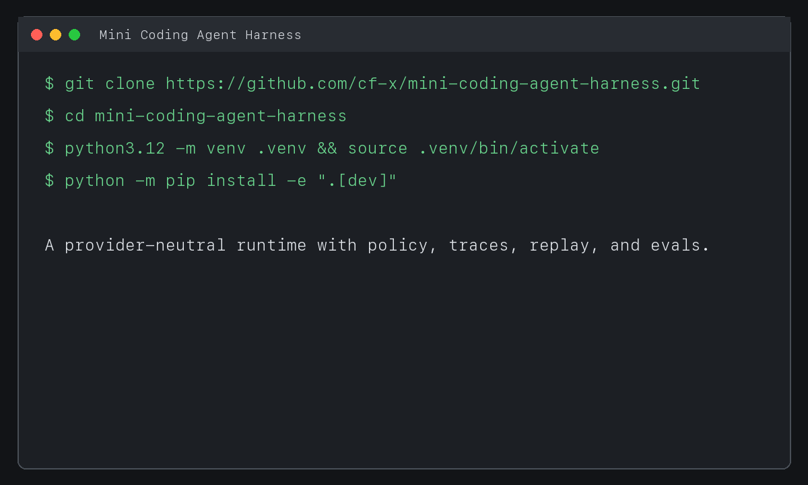
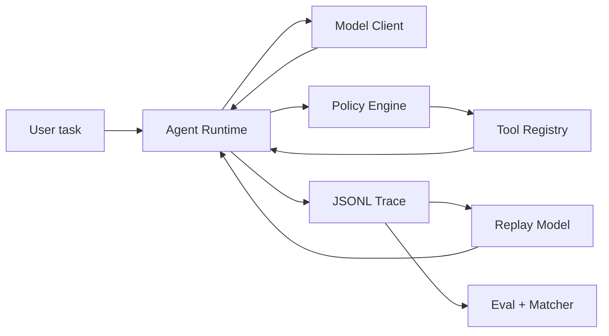

# Mini Coding Agent Harness

[简体中文](README.zh-CN.md)

A small, testable coding-agent harness with explicit policy checks, append-only JSONL
traces, offline model-response replay, and deterministic evaluations.

The project focuses on one engineering question:

> How can a minimal coding agent remain observable, bounded, and regression-testable
> without turning into a general-purpose agent framework?

It implements the harness around a model, not a new model or a production sandbox.



The demo shows the offline conformance eval, sanitized traces, replay divergence, and
credential-free live-case validation. It does not depict a fabricated real-model run.

## What is included

- A provider-neutral async agent loop with bounded turns.
- `read_file`, `write_file`, `edit_file`, and `bash` tools.
- Injectable Local and Docker command executors for `bash`.
- Pydantic validation at the tool boundary.
- Workspace path containment, including resolved symlink checks.
- `allow`, `ask`, and `deny` policy decisions before execution.
- Shell timeout, process-group termination, and output truncation.
- Append-only JSONL traces with secret redaction.
- Offline replay using recorded model responses.
- First-divergence matching over normalized tool calls.
- Ten deterministic eval cases that do not call a real model.
- OpenAI Responses, optional prompt-tool compatibility, Anthropic, and replay model clients.
- Five checked-in live coding cases with deterministic acceptance tests and incremental reports.
- Unit, integration, CLI, and end-to-end eval tests.

This project intentionally does **not** include multi-agent orchestration, task DAGs,
MCP, durable execution, a web UI, or a production-grade sandbox.

## Architecture



The runtime owns only the state machine. Model adapters decide what to request, policy
classifies a request, the registry validates and executes it, and the recorder observes
each boundary. Eval code is downstream and never decides runtime behavior.

A permitted tool call produces this trace sequence:

```text
tool_requested -> policy_decided -> tool_started -> tool_finished
```

A denied call omits `tool_started` but still produces a structured `tool_finished`, so
every model tool request receives exactly one result.

## Quick start

Python 3.11 or newer is required.

```bash
cd mini-coding-agent-harness
python3.12 -m venv .venv
source .venv/bin/activate
python -m pip install -e ".[dev]"
mini-harness eval evals/cases
```

The eval command uses scripted model responses and sends no network request.

For a live OpenAI run:

```bash
./scripts/macos-keychain-openai setup  # first use or credential rotation only
./scripts/macos-keychain-openai run run \
  --workspace ./example-workspace \
  "Inspect the tests, fix the bug, and run the relevant test command."
```

On macOS, the wrapper stores an OpenAI-style `sk-` key and optional base URL in the login
Keychain, then injects them only into the repository's `.venv/bin/mini-harness` process.
Linux, CI, and temporary runs can still use the `OPENAI_API_KEY` and optional
`OPENAI_BASE_URL` environment variables. Never commit real values.

The default `--tool-mode auto` uses native Responses function tools. If a compatible gateway
explicitly rejects function tools, it can fall back on a JSON prompt protocol. Use
`--tool-mode function` to require native tools or `--tool-mode prompt` to select the
compatibility path explicitly. Reports identify the configured backend; prompt mode is not
presented as native function calling.

Some gateways restrict OpenAI subscription-backed accounts to the Codex Responses client
contract. Select `--client-profile codex` explicitly for those gateways; the default
`standard` profile keeps normal OpenAI SDK headers. This setting contains no credential and
does not change how `OPENAI_API_KEY` is loaded. The Codex profile uses stateless HTTP
continuation because compatible gateways may reserve `previous_response_id` for Responses
WebSocket v2.

Writes and shell commands default to `ask`. Use `--auto-approve` only in a workspace you
control. A live trace is written under `<workspace>/traces/`.

`bash` remains local by default. To run only Bash commands in a short-lived Docker
container, make the configured image available locally, then select the executor explicitly:

```bash
docker pull python:3.12-slim
mini-harness run --executor docker --docker-image python:3.12-slim \
  --workspace ./example-workspace "Inspect the tests and fix the bug."
```

The Harness never pulls an image implicitly. CPU, memory, and PID limits can be set with
`--docker-cpus`, `--docker-memory-mb`, and `--docker-pids-limit`, or in TOML.

## CLI

```text
mini-harness run TASK [--workspace PATH] [--executor local|docker] [--config FILE]
mini-harness replay TRACE [--workspace PATH] [--output-trace FILE]
mini-harness eval [CASES_DIR] [--json]
mini-harness live-eval [CASES_DIR] [--executor local|docker] [--validate-only]
mini-harness trace TRACE
```

- `run` defaults to the OpenAI Responses API; Anthropic remains available with
  `--provider anthropic`.
- `replay` extracts recorded model responses, executes current policy and tool code, and
  compares normalized tool-call sequences.
- `eval` copies each fixture into a fresh temporary workspace and runs deterministic
  assertions.
- `live-eval` runs five real-model coding fixtures repeatedly and saves incremental JSON,
  Markdown, usage, duration, failure categories, and sanitized traces.
- `trace` prints event counts and the terminal run event.

See [`mini-harness.example.toml`](mini-harness.example.toml) and [`.env.example`](.env.example)
for configuration.

## Trace and replay model

Each trace line is one independently flushed JSON object. Event types are:

```text
run_started
model_request
model_response
tool_requested
policy_decided
tool_started
tool_finished
run_finished
run_failed
```

The reader can ignore a malformed final line left by process termination, but rejects a
malformed event in the middle of a trace. Common credential keys and recognizable API
key forms are redacted. Content read from paths matching `sensitive_paths` is also
redacted from tool events and subsequent recorded model responses.

Replay is intentionally narrower than full deterministic execution:

1. Read the recorded `model_response` events.
2. Feed them to the normal runtime in the same order.
3. Re-run current policy and tool implementations in a clean fixture.
4. Compare tool name and normalized arguments.
5. Return the first missing, extra, name, or argument divergence.

Replay does not restore arbitrary external side effects, clocks, network responses, or a
previous filesystem snapshot. Eval fixtures provide the repeatable starting state.

## Deterministic evals

The ten checked-in cases cover:

1. successful file read;
2. edit followed by tests;
3. workspace path escape;
4. dangerous shell command;
5. tool execution error;
6. unknown tool;
7. output truncation;
8. maximum-turn termination;
9. matching replay;
10. first replay divergence.

Assertions inspect file existence/content, command exit codes, tools used or avoided,
policy decisions, tool statuses, truncation flags, call counts, run status, and replay
divergence. No LLM-as-a-judge is used.

## Live evals

Live evals are deliberately separate from harness conformance tests. Validate all five cases
without a credential or network request:

```bash
mini-harness live-eval evals/live_cases --validate-only
```

Run the intended 5 cases x 3 attempts only when a working model credential is available:

```bash
./scripts/macos-keychain-openai run live-eval evals/live_cases --runs 3
```

Every attempt starts from a clean fixture and is accepted by file assertions and `unittest`
exit codes, not an LLM judge. For `gpt-5.6-sol`, `gpt-5.6-terra`, and `gpt-5.6-luna`, cost
estimates use [OpenAI Standard API pricing](https://developers.openai.com/api/docs/pricing)
and record that source with the result. A compatible gateway's actual bill may differ.

Two versioned 15-attempt `gpt-5.6-terra` runs completed on 2026-07-26. v1 preserved the
original strict result of 7/15 (46.7%) and exposed an over-specific edit-tool rubric plus a
Python environment mismatch. v2 pinned the Harness interpreter, added layered metrics and a
bounded finalization path, and accepted either supported file-modification tool. It passed
13/15 strictly (86.7%), reached 100% Pass@3, completed 15/15 runtimes, and retained 15/15
artifact correctness. The remaining two failures were isolated `read_file` contract
deviations. The rubric change means the strict scores are versioned rather than a pure
model-only comparison. See the [v1 analysis](docs/live-eval-2026-07-26.md) and
[sanitized v1/v2 comparison](docs/live-eval-v1-v2-comparison.md).
The [local live-eval runbook](docs/live-eval-runbook.zh-CN.md) documents Python selection,
macOS Keychain setup, temporary environment-variable fallback, gateway profiles, smoke
testing, versioned reruns, and sanitization checks.

## Inspectable evidence

These checked-in files are deterministic harness examples generated by
[`scripts/generate_demo_artifacts.py`](scripts/generate_demo_artifacts.py), not live-model
benchmark results:

- [successful edit and test trace](examples/traces/successful-edit.jsonl)
- [dangerous command denial trace](examples/traces/dangerous-command-denied.jsonl)
- [first replay divergence](examples/replay/first-divergence.json)

Inspect and replay them:

```bash
mini-harness trace examples/traces/dangerous-command-denied.jsonl
demo_workspace="$(mktemp -d)"
cp -R evals/cases/edit_and_test/fixture/. "$demo_workspace/"
mini-harness replay examples/traces/successful-edit.jsonl \
  --workspace "$demo_workspace" --auto-approve
```

Validated project results are recorded only after running the suite on the current
revision:

<!-- VERIFIED_RESULTS_START -->

Verified on 2026-07-26 with Python 3.12.13 on macOS arm64:

- Ruff lint and format checks: passed.
- MyPy strict check: passed for 44 checked source/test files.
- pytest: 71 passed, including real Docker integration coverage for workspace isolation,
  minimal environment, non-root execution, disabled networking, and timeout cleanup.
- deterministic evals: 10/10 cases passed.

<!-- VERIFIED_RESULTS_END -->

## Security boundary

The policy engine is a transparent risk classifier, **not a security sandbox**. The default
Local executor still runs Bash on the host.

It resolves file paths and symlinks against one workspace and rejects several obvious
destructive command forms. String matching cannot cover shell expansion, interpreters,
child processes, filesystem mounts, network access, or unknown binaries. Do not run
untrusted tasks with the Local executor on a sensitive host.

The optional Docker executor isolates **only `bash`**. It bind-mounts the resolved Workspace
read-write at `/workspace`, runs with the host's non-root UID/GID, disables networking by
default, applies CPU/memory/PID limits, and passes no host API keys or `HOME`. File Tools
remain in the host process. Container isolation still depends on the Docker daemon, image,
host kernel, and configuration; it is not an absolute security boundary.

## Development

```bash
ruff check .
ruff format --check .
mypy
pytest
mini-harness eval evals/cases
```

CI runs these checks on Python 3.11 and 3.12. Tests do not require an API key and must not
send live model requests.

See [`CONTRIBUTING.md`](CONTRIBUTING.md) for change requirements and
[`SECURITY.md`](SECURITY.md) for the security model and reporting guidance.

## Design choices

| Choice | Reason | Tradeoff |
|---|---|---|
| Direct async state machine | Keeps model, policy, tools, and trace replaceable | No workflow graph or durable resume |
| JSONL | Append-only, diffable, inspectable, easy to replay | No indexed query backend |
| Scripted/replay model in tests | Fast, deterministic, and free of provider calls | Does not measure live model quality |
| Deterministic assertions | Failures map to concrete evidence | Cannot grade subjective answer quality |
| Policy before registry execution | Denied operations never reach tool handlers | Policy is still not isolation |
| Exact-text edit tool | Predictable and testable | Less flexible than patch-based editing |

## References, attribution, and reuse

The repository is an original implementation. The lists below distinguish projects consulted
for the current design from comparison candidates and runtime dependencies. It does not copy
source files or substantial code blocks from these projects.

### Repositories consulted for the current design

- [`shareAI-lab/learn-claude-code`](https://github.com/shareAI-lab/learn-claude-code)
  (MIT): the progressive teaching examples informed the basic agent-loop, tool-dispatch,
  and permission-pipeline framing. This project restructures those ideas into independent
  runtime, policy, trace, replay, and eval modules. No source code is vendored.
- [`openai/codex`](https://github.com/openai/codex) (Apache-2.0): referenced at a
  conceptual level for separating permission decisions from execution isolation. Codex is
  not a dependency and no Codex source is included.

### Comparison projects, not integrated

- [`laude-institute/harbor`](https://github.com/laude-institute/harbor): referenced for
  future black-box agent evaluation and trajectory interoperability, including ATIF. Harbor
  is not part of the MVP and no Harbor code is included.
- [`SWE-agent/SWE-ReX`](https://github.com/SWE-agent/SWE-ReX): referenced only as a
  possible future execution-isolation adapter. It is not included.

### Runtime dependencies

- [`anthropics/anthropic-sdk-python`](https://github.com/anthropics/anthropic-sdk-python)
  for optional live Anthropic API calls.
- [`openai/openai-python`](https://github.com/openai/openai-python) for OpenAI Responses API
  calls and OpenAI-compatible endpoints.
- [Pydantic](https://github.com/pydantic/pydantic) for schemas and validation.
- [Typer](https://github.com/fastapi/typer) for the CLI.
- [PyYAML](https://github.com/yaml/pyyaml) for eval-case files.
- pytest, pytest-asyncio, Ruff, and MyPy for development verification.

Dependency licenses and transitive notices remain governed by their respective projects.
See [`pyproject.toml`](pyproject.toml) for version constraints. Contributions should avoid
copying external implementations; integrations should use public APIs or documented trace
formats.

## License

MIT. See [`LICENSE`](LICENSE).
