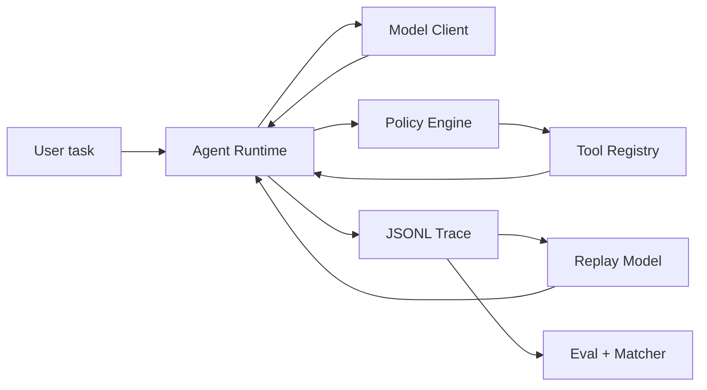

# Mini Coding Agent Harness

[简体中文](README.zh-CN.md)

A small, testable coding-agent harness with explicit policy checks, append-only JSONL
traces, offline model-response replay, and deterministic evaluations.

The project focuses on one engineering question:

> How can a minimal coding agent remain observable, bounded, and regression-testable
> without turning into a general-purpose agent framework?

It implements the harness around a model, not a new model or a production sandbox.

## What is included

- A provider-neutral async agent loop with bounded turns.
- `read_file`, `write_file`, `edit_file`, and `bash` tools.
- Pydantic validation at the tool boundary.
- Workspace path containment, including resolved symlink checks.
- `allow`, `ask`, and `deny` policy decisions before execution.
- Shell timeout, process-group termination, and output truncation.
- Append-only JSONL traces with secret redaction.
- Offline replay using recorded model responses.
- First-divergence matching over normalized tool calls.
- Ten deterministic eval cases that do not call a real model.
- Unit, integration, CLI, and end-to-end eval tests.

This project intentionally does **not** include multi-agent orchestration, task DAGs,
MCP, durable execution, a web UI, or an OS-level sandbox.

## Architecture



The runtime owns only the state machine. Model adapters decide what to request, policy
classifies a request, the registry validates and executes it, and the recorder observes
each boundary. Eval code is downstream and never decides runtime behavior.

A permitted tool call produces this trace sequence:

```text
tool_requested -> policy_decided -> tool_started -> tool_finished
```

A denied call omits `tool_started` but still produces a structured `tool_finished`, so
every model tool request receives exactly one result.

## Quick start

Python 3.11 or newer is required.

```bash
git clone <your-fork-or-repository-url>
cd mini-coding-agent-harness
python3.12 -m venv .venv
source .venv/bin/activate
python -m pip install -e ".[dev]"
mini-harness eval evals/cases
```

The eval command uses scripted model responses and sends no network request.

For a live Anthropic run:

```bash
export ANTHROPIC_API_KEY="..."
mini-harness run \
  --workspace ./example-workspace \
  "Inspect the tests, fix the bug, and run the relevant test command."
```

Writes and shell commands default to `ask`. Use `--auto-approve` only in a workspace you
control. A live trace is written under `<workspace>/traces/`.

## CLI

```text
mini-harness run TASK [--workspace PATH] [--config FILE] [--trace FILE]
mini-harness replay TRACE [--workspace PATH] [--output-trace FILE]
mini-harness eval [CASES_DIR] [--json]
mini-harness trace TRACE
```

- `run` uses the Anthropic SDK.
- `replay` extracts recorded model responses, executes current policy and tool code, and
  compares normalized tool-call sequences.
- `eval` copies each fixture into a fresh temporary workspace and runs deterministic
  assertions.
- `trace` prints event counts and the terminal run event.

See [`mini-harness.example.toml`](mini-harness.example.toml) and [`.env.example`](.env.example)
for configuration.

## Trace and replay model

Each trace line is one independently flushed JSON object. Event types are:

```text
run_started
model_request
model_response
tool_requested
policy_decided
tool_started
tool_finished
run_finished
run_failed
```

The reader can ignore a malformed final line left by process termination, but rejects a
malformed event in the middle of a trace. Common credential keys and recognizable API
key forms are redacted. Content read from paths matching `sensitive_paths` is also
redacted from tool events and subsequent recorded model responses.

Replay is intentionally narrower than full deterministic execution:

1. Read the recorded `model_response` events.
2. Feed them to the normal runtime in the same order.
3. Re-run current policy and tool implementations in a clean fixture.
4. Compare tool name and normalized arguments.
5. Return the first missing, extra, name, or argument divergence.

Replay does not restore arbitrary external side effects, clocks, network responses, or a
previous filesystem snapshot. Eval fixtures provide the repeatable starting state.

## Deterministic evals

The ten checked-in cases cover:

1. successful file read;
2. edit followed by tests;
3. workspace path escape;
4. dangerous shell command;
5. tool execution error;
6. unknown tool;
7. output truncation;
8. maximum-turn termination;
9. matching replay;
10. first replay divergence.

Assertions inspect file existence/content, command exit codes, tools used or avoided,
policy decisions, tool statuses, truncation flags, call counts, run status, and replay
divergence. No LLM-as-a-judge is used.

Validated project results are recorded only after running the suite on the current
revision:

<!-- VERIFIED_RESULTS_START -->

Verified on 2026-07-26 with Python 3.12.13 on macOS arm64:

- Ruff lint and format checks: passed.
- MyPy strict check: passed for 36 checked source/test files.
- pytest: 41 passed.
- deterministic evals: 10/10 cases passed.
- task pass rate: 100.0%.
- average turns: 2.20.
- average tool calls: 1.30.
- tool error rate: 23.1%.
- policy denials: 2.
- replay match rate: 50.0%.
- average run duration: 26.40 ms in one local sample.

The tool-error rate includes intentional error, timeout, and unknown-tool results. The
replay-match rate includes one intentionally divergent replay, so a 50% raw match rate is
compatible with all replay assertions passing. Duration is environment-dependent and is
not a performance claim.

<!-- VERIFIED_RESULTS_END -->

## Security boundary

The policy engine is a transparent risk classifier, **not a security sandbox**.

It resolves file paths and symlinks against one workspace and rejects several obvious
destructive command forms. String matching cannot cover shell expansion, interpreters,
child processes, filesystem mounts, network access, or unknown binaries. Do not run
untrusted tasks on a sensitive host. A production version should execute tools inside an
isolation layer such as a container, VM, SWE-ReX, or another purpose-built sandbox.

## Development

```bash
ruff check .
ruff format --check .
mypy
pytest
mini-harness eval evals/cases
```

CI runs these checks on Python 3.11 and 3.12. Tests do not require an API key and must not
send live model requests.

See [`CONTRIBUTING.md`](CONTRIBUTING.md) for change requirements and
[`SECURITY.md`](SECURITY.md) for the security model and reporting guidance.

## Design choices

| Choice | Reason | Tradeoff |
|---|---|---|
| Direct async state machine | Keeps model, policy, tools, and trace replaceable | No workflow graph or durable resume |
| JSONL | Append-only, diffable, inspectable, easy to replay | No indexed query backend |
| Scripted/replay model in tests | Fast, deterministic, and free of provider calls | Does not measure live model quality |
| Deterministic assertions | Failures map to concrete evidence | Cannot grade subjective answer quality |
| Policy before registry execution | Denied operations never reach tool handlers | Policy is still not isolation |
| Exact-text edit tool | Predictable and testable | Less flexible than patch-based editing |

## References, attribution, and reuse

The repository is an original implementation. It does not copy source files or substantial
code blocks from the projects below.

### Design references

- [`shareAI-lab/learn-claude-code`](https://github.com/shareAI-lab/learn-claude-code)
  (MIT): the progressive teaching examples informed the basic agent-loop, tool-dispatch,
  and permission-pipeline framing. This project restructures those ideas into independent
  runtime, policy, trace, replay, and eval modules. No source code is vendored.
- [`openai/codex`](https://github.com/openai/codex) (Apache-2.0): referenced at a
  conceptual level for separating permission decisions from execution isolation. Codex is
  not a dependency and no Codex source is included.
- [`laude-institute/harbor`](https://github.com/laude-institute/harbor): referenced for
  future black-box agent evaluation and trajectory interoperability, including ATIF. Harbor
  is not part of the MVP and no Harbor code is included.
- [`SWE-agent/SWE-ReX`](https://github.com/SWE-agent/SWE-ReX): referenced only as a
  possible future execution-isolation adapter. It is not included.

### Runtime dependencies

- [`anthropics/anthropic-sdk-python`](https://github.com/anthropics/anthropic-sdk-python)
  for live Anthropic API calls.
- [Pydantic](https://github.com/pydantic/pydantic) for schemas and validation.
- [Typer](https://github.com/fastapi/typer) for the CLI.
- [PyYAML](https://github.com/yaml/pyyaml) for eval-case files.
- pytest, pytest-asyncio, Ruff, and MyPy for development verification.

Dependency licenses and transitive notices remain governed by their respective projects.
See [`pyproject.toml`](pyproject.toml) for version constraints. Contributions should avoid
copying external implementations; integrations should use public APIs or documented trace
formats.

## License

MIT. See [`LICENSE`](LICENSE).
